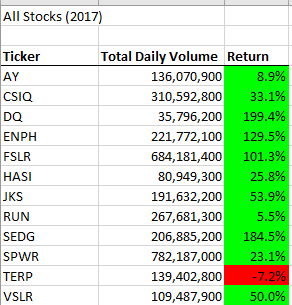
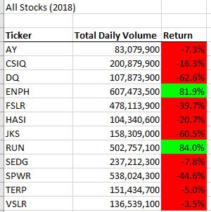
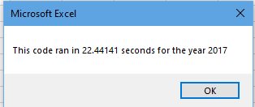
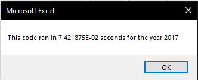

# stock-analysis

## Project Overview
To analyze the performance of a set of stocks that Steve has given us, we will be using the dataset contained in [this Excel sheet](VBA_Challenge.xlsm). This analysis will be performed entirely with excels built in VBA code library. The dataset we will be working with consist of stock prices and trade volume for 12 companies that specialize in alternative energy. The data was taken from the beginning of 2017 to the end of 2018 and is organized by year.

### Purpose
Steve has asked us to help him recommend new stocks for his parents’ portfolio. Currently they only hold stock from DAQO New Energy Corp (DQ). We will help them diversify their portfolio by answering 2 questions.
-	What companies had good yearly returns on price?
-	What companies were very active over the year?
## Analysis
### Method
Our tool for analyzing the dataset will Excels built in VBA. With VBA we will generate a macro that takes looks at a specific year, adds up the volume of trades per company, and calculates the difference in starting and ending price. Our 1st step will be getting user input with `Input Box("What year would you like to run the analysis on?")`. After we have the input, we will set up a for loop with starting and ending rows. To find the ending row we will use [this code] (excel - Better way to find last used row - Stack Overflow) `RowCount = Cells(Rows.Count, "A").End(xlUp).Row` found on stack overflow. From there we will use a For loop to loop from row 2 to the final row. Each loop we will add volume to the running total for the company. We will also check if the company has changed or will change. If it’s the 1st entry for a company set the starting price. If the next entry in the data set is different, then set the ending price and change to the new company. Finally, we will print out and format the data with company name, total volume, and the percent change from starting price to ending price. with the macro we get the results featured below
### Results
 

 Recommendations
  - ENPH
  - RUN
  - SEDG

The most active stock was SPWR trading over 1.25 million units across 2017-2018. This is a sign for a secure stock that can be easily traded. in a year like 2018 Steve’s parents may want to sell off early to retain the great growth they saw in 2017 market. other very active stocks include FSLR, ENPH, and RUN. DQ overall was a relatively low trading stock. This fact makes the stock hard to sell during a down market like the one that was experienced in 2018.

Recommendations
- SPWR
- FLASR
- ENPH
- RUN

Overall when looking at both variables for the market I would recommend that Steve’s parents pick up ENPH, FSLR, and RUN. all three featured amazing trade volume, 2 of them had very strong growth in 2017 and 2 of them featured growth in 2018. DQ had the best growth in 2017 but also fell the most in 2018 this shows that it may be a volatile stock and risky to invest in. overall with only 2 years to look it its thought to make a conclusion on the market as a whole and how it will perform in 2019 and beyond.

## Summary
When reviewing code, it is easy to look at what you did and think it works so its fine. If code gets the job done, is easy to read, and doesn’t take too long then changes shouldn’t be made, after all something may break when working on it. A great programmer will always strive to make code that can easily be read, expanded, and improved. While one part of a project may work fine on its own, when combined with a hundred other routines and multiple calls it may really bog down the program. Sometimes we want to add new things to a program but the way the code is structured doesn’t allow the programmer to make changes without the programmer scraping large sections or visiting a hundred different locations in a large multi part program saved over several files and databases. For code that is hard to read, it can be tough for someone to go in after you’ve left and figure out what’s going on and how you did things after you have already left. It’s impossible for you to instruct every person who follows you on what you were thinking at the time, sometimes even for your future self, so good easy to read code is important. Programs should always be worked on to run faster, be easy to understand, and easy to learn

     

In this program we can see what we were able to do by refactoring a little bit of code to run better. Both macros follow the same methodology to get to the end results, but the refactored code runs in a fraction of the time that the old code does. There are 2 major reasons for this change. The 1st big change is removing the nested for loop, instead of running 3,011 times for all 12 major companies for 36,132 passes total, we were able to cut it down to a single run of 3011. This reduces the time the program spends doing things and saves us a lot of time along with the other change we made. Excel and VBA are powerful tools that can do a lot for the user and a part they can do everything you would want done. When excel and VBA are combined however it creates a slow program that takes a long time to do simple task. Every company we loop through in the 1st set of code we print onto an excel sheet writing onto and excel sheet is a very slow process from VBA, excel must update the graphics it shows you every time and has to recalculate everything in the workbook to make sure nothing else was affected. All this is going on while still trying to run VBA in the background. By moving the process out of the large, nested loop we can cut down on the number of things excel is trying to do and show at once drastically saving us on time. When working with excel and VBA its always best to reduce the number of read and writes when possible and try to turn off calculation and screen updates while code is running. This with help give us code that runs cleaner from a user perspective and faster. With these techniques code that is 10 minutes long can even run in the span of 1 or 2 minutes. In this case it went from 22 seconds to a fraction of a second.
